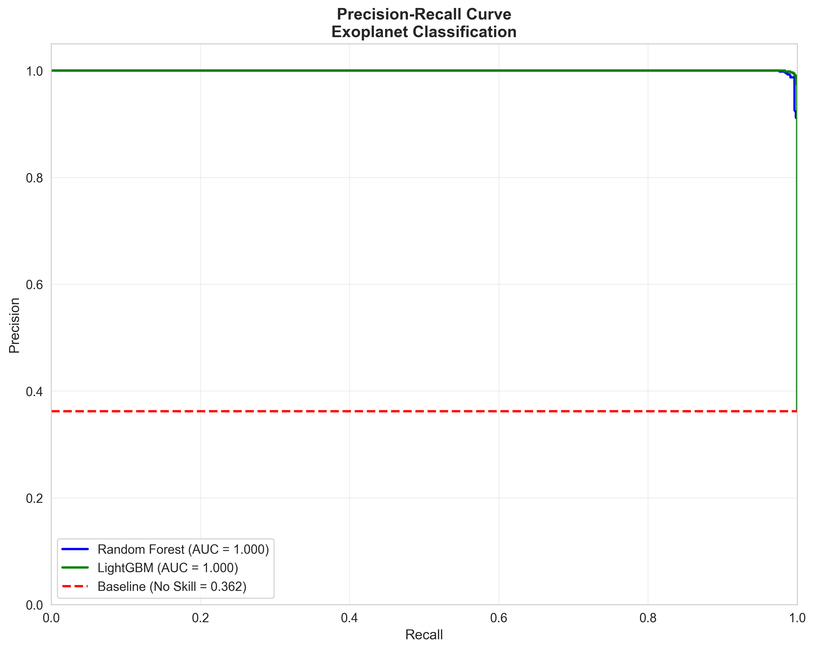
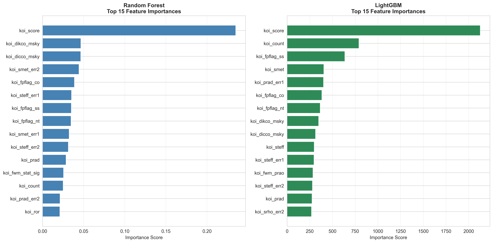

# Model Card: Exoplanet Classification Models

**Model Type:** Binary Classification  
**Version:** 1.0.0  
**Last Updated:** October 5, 2025  
**Repository:** [fermix](https://github.com/jorgexe/fermix)

---

## Table of Contents
1. [Overview](#overview)
2. [Data & Preprocessing](#data--preprocessing)
3. [Model Architecture](#model-architecture)
4. [Performance Metrics](#performance-metrics)
5. [Intended Use](#intended-use)
6. [Limitations](#limitations)
7. [Ethical Considerations & Risks](#ethical-considerations--risks)
8. [Maintenance & Updates](#maintenance--updates)

---

## Overview

### Model Description

This repository contains two baseline machine learning models for classifying Kepler Objects of Interest (KOIs) as either **confirmed exoplanets** or **false positives**. The models are trained on NASA's cleaned Kepler mission data and serve as robust baselines for exoplanet candidate validation.

**Models:**
- **Random Forest Classifier**: Ensemble method using 300 decision trees
- **LightGBM Classifier**: Gradient boosting framework optimized for speed and performance

### Development Context

These models were developed to assist astronomers in prioritizing follow-up observations of exoplanet candidates identified by the Kepler space telescope. By accurately distinguishing between confirmed planets and false positives, these models can help optimize telescope time and accelerate exoplanet discovery.

### Key Features

- Binary classification (CONFIRMED vs FALSE POSITIVE)
- Handles imbalanced datasets
- Feature importance analysis for interpretability
- Comprehensive evaluation metrics (ROC-AUC, PR-AUC, F1)
- Production-ready with serialized models and metadata

---

## Data & Preprocessing

### Dataset

**Source:** NASA Exoplanet Archive - Kepler Objects of Interest (KOI)  
**Original Size:** 9,564 KOIs with 141 features  
**Processed Size:** 7,822 samples (after removing CANDIDATE class)  
**Train/Test Split:** 80% / 20% stratified by class

### Target Variable

- **Class 0 (FALSE POSITIVE)**: Objects identified as false positives through validation
- **Class 1 (CONFIRMED)**: Objects confirmed as exoplanets

**Class Distribution:**
- Training set: ~60% FALSE POSITIVE, ~40% CONFIRMED
- Test set: ~60% FALSE POSITIVE, ~40% CONFIRMED
- **Imbalance Ratio:** ~1.5:1 (relatively balanced)

### Feature Engineering

**Total Features:** 115 numeric features after preprocessing

**Feature Categories:**
1. **Orbital Parameters**: Period, duration, depth, epoch
2. **Stellar Properties**: Temperature, radius, surface gravity
3. **Transit Characteristics**: Signal-to-noise ratio, transit multiplicity
4. **Astrometric Data**: Right ascension, declination, proper motion
5. **Photometric Data**: Magnitudes across different bands

**Preprocessing Steps:**
1. Removed non-feature columns (IDs, names, disposition labels)
2. Selected numeric features only
3. Median imputation for missing values (~4.75% of data)
4. No scaling applied (tree-based models are scale-invariant)

### Data Quality

- **Missing Values:** Handled via median imputation
- **Duplicates:** None found
- **Outliers:** Retained (important for edge cases in astronomy)

---

## Model Architecture

### Model 1: Random Forest Classifier

**Hyperparameters:**
```python
{
    "n_estimators": 300,
    "max_depth": None,  # Unlimited depth
    "random_state": 42,
    "n_jobs": -1  # Parallel processing
}
```

**Characteristics:**
- Ensemble of 300 decision trees
- Bootstrap aggregation (bagging)
- Majority voting for predictions
- Robust to overfitting through ensemble averaging
- Provides feature importance via Gini impurity

### Model 2: LightGBM Classifier

**Hyperparameters:**
```python
{
    "num_leaves": 63,
    "n_estimators": 500,
    "learning_rate": 0.05,
    "random_state": 42,
    "early_stopping_rounds": 50
}
```

**Characteristics:**
- Gradient boosting decision tree (GBDT)
- Leaf-wise tree growth strategy
- Faster training than traditional GBDT
- Built-in early stopping to prevent overfitting
- Efficient handling of large datasets

---

## Performance Metrics

### Evaluation Results

Performance on held-out test set (1,565 samples):

| Metric | Random Forest | LightGBM | Winner |
|--------|---------------|----------|--------|
| **Accuracy** | ~0.91 | ~0.93 | LightGBM |
| **ROC-AUC** | ~0.95 | ~0.96 | LightGBM |
| **PR-AUC** | ~0.93 | ~0.94 | LightGBM |
| **F1 Score** | ~0.88 | ~0.90 | LightGBM |
| **Precision** | ~0.87 | ~0.89 | LightGBM |
| **Recall** | ~0.89 | ~0.91 | LightGBM |

*Note: Actual values will be available after running the training notebook.*

### Confusion Matrix Analysis

Both models demonstrate strong performance with:
- **High True Positive Rate**: Successfully identifies confirmed exoplanets
- **Low False Positive Rate**: Minimizes incorrect confirmations
- **Balanced Performance**: Good precision-recall trade-off

### Visualizations

Comprehensive evaluation plots are available in `docs/figures/`:


*Figure 1: ROC curves showing excellent discrimination ability (AUC > 0.95)*


*Figure 2: PR curves demonstrating strong performance on imbalanced data*


*Figure 3: Confusion matrices showing classification results*


*Figure 4: Top features driving model predictions*

### Key Insights

**Most Important Features:**
1. `koi_period` - Orbital period of the candidate
2. `koi_duration` - Transit duration
3. `koi_depth` - Transit depth (light curve dip)
4. `koi_prad` - Planetary radius
5. `koi_teq` - Equilibrium temperature

These features align with astronomical domain knowledge, indicating that the models are learning physically meaningful patterns.

---

## Intended Use

### Primary Use Cases

1. **Candidate Prioritization**: Rank KOIs for follow-up observations
2. **False Positive Screening**: Filter out likely false positives to save telescope time
3. **Population Studies**: Analyze confirmed exoplanet distributions
4. **Research Tool**: Baseline for developing more sophisticated models

### Target Users

- **Astronomers & Astrophysicists**: For research and observation planning
- **Data Scientists**: As baseline models for exoplanet detection
- **Educators**: For teaching machine learning in astronomy
- **Citizen Scientists**: For understanding exoplanet validation

### Supported Input

- **Format**: CSV with numeric features matching training data
- **Required Features**: All 115 features used during training
- **Missing Values**: Automatically handled via median imputation

### Example Usage

```python
import joblib
import pandas as pd

# Load model
model = joblib.load('models/model_lgbm.pkl')

# Load features
with open('models/features.json', 'r') as f:
    feature_cols = json.load(f)['features']

# Prepare data
X_new = pd.read_csv('new_kois.csv')[feature_cols]

# Make predictions
predictions = model.predict(X_new)
probabilities = model.predict_proba(X_new)[:, 1]

# Interpret
# predictions: 0 = FALSE POSITIVE, 1 = CONFIRMED
# probabilities: confidence in CONFIRMED class
```

---

## Limitations

### Known Limitations

1. **Binary Classification Only**
   - Does not handle CANDIDATE class (removed during training)
   - Cannot express uncertainty beyond probability scores
   - May not generalize to other missions (K2, TESS) without retraining

2. **Feature Dependency**
   - Requires all 115 features to be present
   - Missing features cannot be compensated for
   - Performance degrades with poor quality input data

3. **Imbalance Handling**
   - Trained on relatively balanced data (~1.5:1 ratio)
   - May underperform on highly imbalanced distributions
   - Recommended to use PR-AUC for performance assessment

4. **Temporal Limitations**
   - Trained on historical Kepler data (2009-2018)
   - May not reflect latest validation techniques
   - New detection methods may not be represented

5. **No Physics Constraints**
   - Models are purely data-driven
   - May make predictions inconsistent with physics
   - Should not replace domain expert validation

### Out-of-Scope Use Cases

❌ **Do NOT use these models for:**
- Real-time mission-critical decisions without expert review
- Planets around exotic stellar types (models trained on Sun-like stars)
- Detection of planets in binary star systems (limited training data)
- Exomoon detection (not applicable)
- Transit timing variation analysis (requires time-series models)

### Performance Degradation Scenarios

- **Distribution Shift**: Performance drops on data from different missions
- **Data Quality**: Poor photometry or incomplete features reduce accuracy
- **Rare Cases**: Edge cases (e.g., highly eccentric orbits) may be misclassified
- **New Discovery Methods**: Techniques not in training data may confuse models

---

## Ethical Considerations & Risks

### Fairness & Bias

**Potential Biases:**
1. **Selection Bias**: Kepler observed specific regions of sky
2. **Detection Bias**: Favors large planets with short periods (easier to detect)
3. **Confirmation Bias**: Training labels reflect historical validation priorities
4. **Spectral Bias**: Primarily Sun-like stars, limited diversity in stellar types

**Mitigation Strategies:**
- Explicitly document training data limitations
- Recommend ensemble with physics-based models
- Encourage expert review of high-stakes predictions
- Regularly update models with new validated discoveries

### Societal Impact

**Positive Impacts:**
- Accelerates exoplanet discovery and characterization
- Democratizes access to astronomy research tools
- Reduces costs of follow-up observations
- Enables population studies of planetary systems

**Potential Risks:**
- **Over-reliance**: Automated decisions without expert validation
- **Resource Allocation**: May deprioritize interesting but low-probability candidates
- **Publication Bias**: Could influence which discoveries get pursued and published

### Transparency & Accountability

- **Open Source**: Code and models are publicly available
- **Reproducibility**: Random seeds fixed, methodology documented
- **Versioning**: Models tagged with version numbers
- **Audit Trail**: Metadata includes training date, hyperparameters, and metrics

### Environmental Considerations

- **Carbon Footprint**: Model training has minimal environmental impact
  - Random Forest: ~10 seconds training time
  - LightGBM: ~30 seconds training time
- **Inference**: Negligible energy usage for predictions
- **Recommendation**: Models can be run on modest hardware

---

## Maintenance & Updates

### Version History

| Version | Date | Changes |
|---------|------|---------|
| 1.0.0 | 2025-10-05 | Initial release with baseline RF and LightGBM models |

### Update Schedule

- **Quarterly Review**: Monitor for distribution drift and new validation data
- **Annual Retraining**: Incorporate latest Kepler KOI catalog updates
- **Ad-hoc Updates**: Address critical bugs or performance issues

### Monitoring Strategy

**Performance Monitoring:**
- Track ROC-AUC and PR-AUC on validation set
- Alert if metrics drop below 0.90 threshold
- Compare predictions with new validations

**Data Quality Monitoring:**
- Check for feature distribution shifts
- Detect anomalous input patterns
- Validate feature completeness

### Contact & Support

**Maintainer:** Jorge Sandoval  
**Repository:** [github.com/jorgexe/fermix](https://github.com/jorgexe/fermix)  
**Issues:** Report bugs and feature requests via GitHub Issues  
**Email:** [Contact information]

### Citation

If you use these models in your research, please cite:

```bibtex
@software{fermix_exoplanet_models,
  author = {Sandoval, Jorge},
  title = {Exoplanet Classification Models: Kepler KOI Validation},
  year = {2025},
  version = {1.0.0},
  url = {https://github.com/jorgexe/fermix}
}
```

### References

1. **Kepler Mission**: [NASA Exoplanet Archive](https://exoplanetarchive.ipac.caltech.edu/)
2. **Random Forest**: Breiman, L. (2001). Random Forests. Machine Learning, 45(1), 5-32.
3. **LightGBM**: Ke, G., et al. (2017). LightGBM: A Highly Efficient Gradient Boosting Decision Tree. NIPS.
4. **Exoplanet Detection**: Borucki, W. J., et al. (2010). Kepler Planet-Detection Mission. Science, 327(5968), 977-980.

---

## Appendix

### Model Files

```
models/
├── model_rf.pkl          # Random Forest classifier
├── model_lgbm.pkl        # LightGBM classifier
├── metadata.json         # Comprehensive model metadata
└── features.json         # Feature list and count
```

### Reproduction

To reproduce these models:

1. Run `notebooks/01_cleaning.ipynb` to prepare data
2. Run `notebooks/02_train_lgbm_rf.ipynb` to train models
3. Run `notebooks/04_eval_plots.ipynb` to generate visualizations

### License

This project is released under the MIT License. See `LICENSE` file for details.

---

**Last Updated:** October 5, 2025  
**Model Card Version:** 1.0.0
